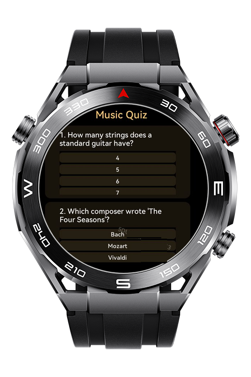
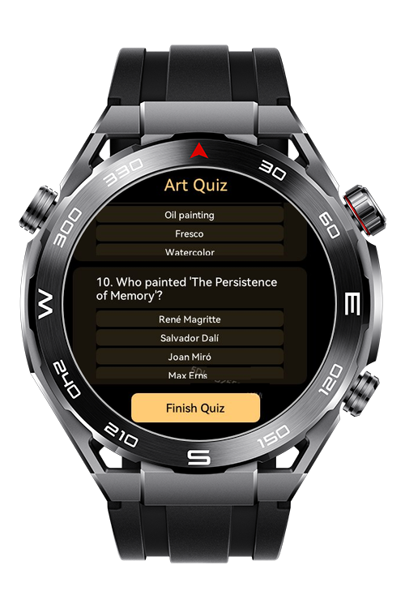
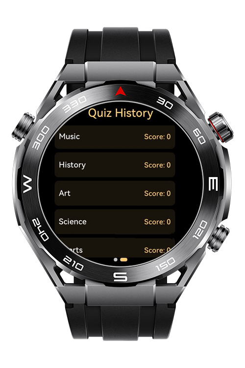

> **Note:** To access all shared projects, get information about environment setup, and view other guides, please visit [Explore-In-HMOS-Wearable Index](https://github.com/Explore-In-HMOS-Wearable/hmos-index).

# QuizGame

This is a basic quiz game that uses storage on lite devices.

## Preview

<div>
    
    
    
    
</div>

## Use Cases

- User can select topic and start quiz.
- User can learn success rate of the quiz and turn back to topics.

## Tech Stack

- **Languages**: HML, JS, CSS
- **Frameworks**: HarmonyOS SDK 5.0.0(12)
- **Tools**: DevEco Studio Vers 5.1.0.842

## Directory Structure
```
entry/
├── src/main/
├── src/main/js/MainAbility
│ ├── pages/art
│ │ ├── art.css
│ │ ├── art.hml
│ │ └── art.js  
│ ├── pages/geography
│ │ ├── geography.css
│ │ ├── geography.hml
│ │ └── geography.js  
│ ├── pages/history
│ │ ├── history.css
│ │ ├── history.hml
│ │ └── history.js  
│ ├── pages/index
│ │ ├── index.css
│ │ ├── index.hml
│ │ └── index.js 
│ ├── pages/music
│ │ ├── music.css
│ │ ├── music.hml
│ │ └── music.js   
│ ├── pages/science
│ │ ├── science.css
│ │ ├── science.hml
│ │ └── science.js   
│ ├── pages/sports
│ │ ├── sports.css
│ │ ├── sports.hml
│ │ └── sports.js   

         
```

# Constraints and Restrictions
## Supported Devices

- All Sport Watch Devices

# LICENSE

Quiz Game is distributed under the terms of the MIT License.
See the [license](/LICENSE) for more information.